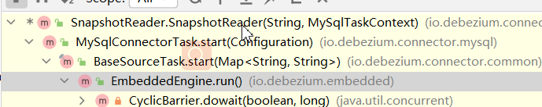
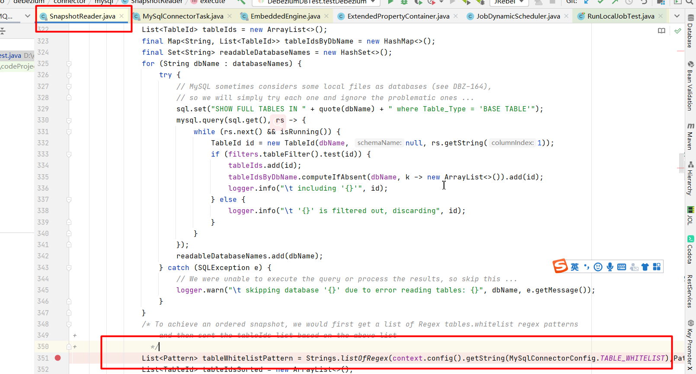
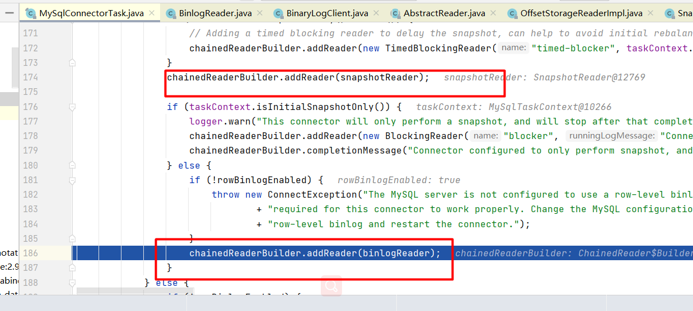

如何配置？

方式一：


这种方式下对数据库rwtest的任意修改都会产生binlog

方式2：

只配置log-bin=mysql-bin 没有配置 binlog-do-db，这个时候 需要在Debezium中通过 下面两个参数指定


如何读取？


当数据来到时的堆栈


==================

Engine Run的时候 会 创建一个reader，这个reader会创建一个BinaryLogClient，其中创建reder的时候传递了config配置信息


taskContext中有一个ConnectionContext，connContext中的config和taskContext中 config是同一个对象


创建连接时指定的链接参数

```java

        this.jdbc = new JdbcConnection(jdbcConfig, JdbcConnection.patternBasedFactory("jdbc:mysql://${hostname}:${port}/?useInformationSchema=true&nullCatalogMeansCurrent=false&useSSL=${useSSL}&useUnicode=true&characterEncoding=UTF-8&characterSetResults=UTF-8&zeroDateTimeBehavior=convertToNull", driverClassName, this.getClass().getClassLoader(), new Field[0]));
这个参数中没有 
     .with("database.dbname", studentDBName)
                //指定监听的表，这里写死监听 指定数据库下的hstudent 和person表
                .with("table.whitelist", studentDBName + ".hstudent"
```


===================







=================




